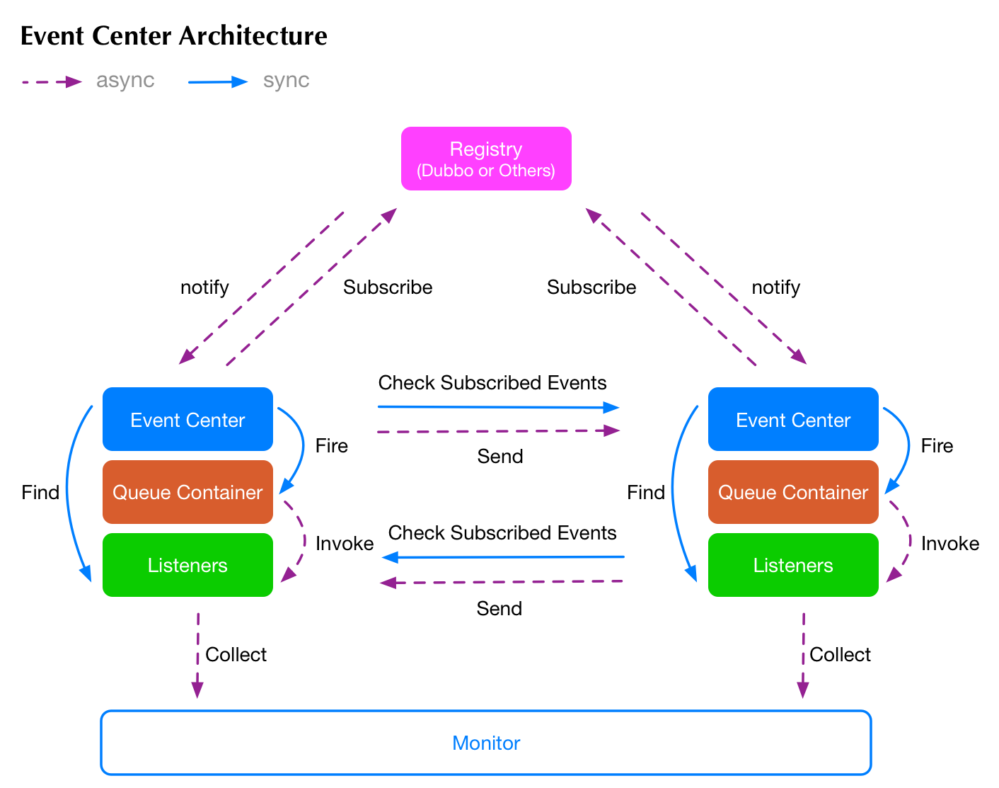

# 事件中心(Event Center)
事件中心提供领域驱动开发中的领域事件的实现框架，它是基于dubbo框架+leveldb存储构建高可用的事件通讯组件。

## 架构


## 功能
 * 简单清晰的接口调用
 * 基于leveldb实现事件队列，保障事件不丢失、不重复消费
 * 基于dubbo实现分布式的事件，并结合leveldb支持离线推送功能，保障分布式事件的数据一致性和服务治理特性
 * 系统接入方便，支持Spring注解和手动编写触发事件
 * 高扩展性，可自定义队列容器、事件订阅机制、事件传输机制等等
 * 支持异步事件、同步事件、分布式事件、并发聚合事件和调度事件
 * 支持监控日志，可写入到elastic search或者其他的日志系统中进行监控

## 开始第一个事件中心的程序

事件中心在使用之前需要构造两个组件，第一个是触发事件的实例：EventCenter；第二个是接收事件的监听器：EventListener。

我们先实现一个简单的监听器：
```java
/**
* 这里需要添加一个注解，用于描述这个监听器所监听的事件，可以支持多个事件同时监听
*/
@ListenerBind("example.saidHello")
public class SimpleEventListener implements EventListener {
    
    @Override
    public void onObserved(CommonEventSource source) {
        // source中传递了事件触发时所带的参数，这里可以原封不动的按照顺序取出
        System.out.println("Hello " + source.getArg(0, String.class));
    }
}
```

好了，接着可以构造一个最基本的事件中心实例：
```java
public class ExampleMain {
    
    public static void main(String[] args) throws Exception {
        DefaultEventCenter eventCenter = new EventCenterBuilder()
                                    // 这里需要将监听器注入进来，后续章节会介绍如何自动注入监听器
                                    .addEventListener(new SimpleEventListener())
                                    .build();
        // 启动事件中心容器
        eventCenter.startup();
        // 接着开始触发事件，打一个招呼
        eventCenter.fireEvent("Main", "example.saidHello", "World");
        // 跟着观察下控制台的输出，这里暂停500ms
        Thread.sleep(500);
        // 最后关闭掉容器
        eventCenter.shutdown();
    }
}
```

运行时，"Hello World"会迅速的打到控制台中，这里的fireEvent是异步执行，不会产生阻塞。事件中心也可以阻塞的触发事件，等待所有监听器都成功执行完成之后，才会释放。但是我不建议大家使用这种方式使用事件，这样破坏了事件本身在系统框架层中的意义。

## 教程
 * 可参考源码中的ec-examples模块，内部有很多demo
 * [教程文档](https://jueming.gitbook.io/eventcenter)(还在持续更新中)
 
## 联系我们
 * Email: usiboy@163.com
 * QQ: 281408062